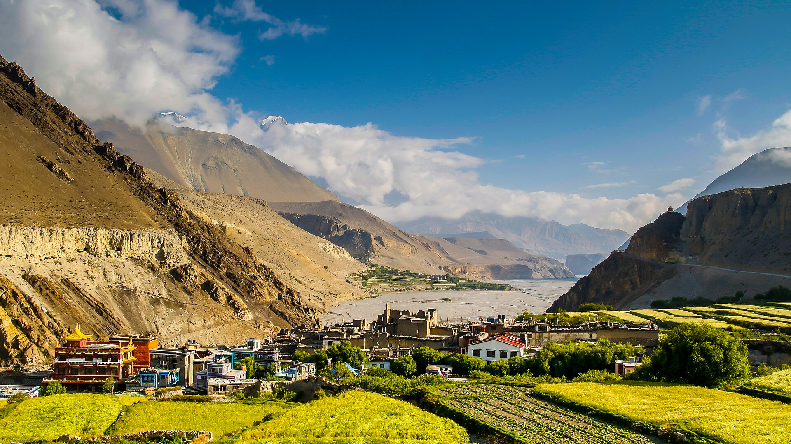

<div align="center">



# KAGBENI — The Windswept Gate of the Forbidden Kingdom

A cinematic, single-page experience about **Kagbeni village (2,804 m)** — the medieval
gateway to Upper Mustang, Nepal, where the Kag Khola meets the Kali Gandaki.

🌐 **Live site: [kagbenimustang.com](https://kagbenimustang.com)**


</div>

## ✨ Sections & features

- **Preloader** — KAGBENI wordmark with a live altitude ticker (0 → 2,804 m), hard-capped so it can never trap the visitor
- **Hero** — full-bleed panorama with giant auto-fitting display type (JS scales the word to any viewport), staggered letter reveal, facts row, news-ticker marquee
- **Manifesto** — editorial statement whose words light up as you scroll, with inline photo chips
- **The Crossroads** — scrollytelling: a sticky image frame crossfades through four photographs as four chapters scroll past (salt trade, the river name, the noon wind, the hillside sign)
- **The Journey** — scroll-driven horizontal rail (Jomsom → Kagbeni → Muktinath → checkpoint → Lo Manthang), with native swipe + scroll-snap fallback on touch and reduced-motion
- **Sacred Kagbeni** — asymmetric grid: Kag Chode monastery (est. 1429), shaligram fossils, Pitri Mokshasthala shraddha rites, Phudzling cave ruins
- **Seasons** — accessible, arrow-key-navigable tabs with animated temperature / wind / sky meters, covering Mustang's rain-shadow monsoon advantage
- **Travel guide** — accordion covering the **2026 permit reform** (US $50/day restricted-area permit), transport, lodging and wind wisdom
- **Gallery** — editorial grid with keyboard-navigable lightbox (arrows / Escape)
- Scroll-progress bar, hide-on-scroll header, film-grain overlay, custom cursor dot (desktop), full `prefers-reduced-motion` support

## 🧱 Tech

Pure HTML/CSS/JS — no build step, no framework, no dependencies. Upload the folder
to any static host and it works.

```
├── index.html          the site (one long-form immersive page)
├── credits.html        image attribution page (keep linked — license requirement)
├── css/style.css       design system (dark / copper / glacier palette)
├── js/main.js          all interactions (vanilla JS)
├── images/             41 photographs (web-sized)
├── image-credits.json  raw license metadata for every photo
└── favicon.svg
```

## 🚀 Run locally

```bash
python -m http.server 8000
# then open http://localhost:8000
```

## 📚 Content accuracy

Facts researched July 2026: elevation and coordinates, Kag Chode Thupten Samphel
Ling's 1429 founding, the Ka-Ga-Beni etymology, salt-trade history, shaligram and
shraddha traditions, Phudzling's 34 ruined houses, and the per-day Upper Mustang
permit pricing. **Re-verify permit rules before future updates — they change.**

## 🖼️ Images & licensing

All 41 photographs are from **Wikimedia Commons** under free licenses
(CC BY / CC BY-SA / public domain). Attribution lives on
[credits.html](credits.html), generated from `image-credits.json` —
keep that page linked in the footer to stay license-compliant.

---

<div align="center">

*Kagbeni, Mustang District, Gandaki Province, Nepal — where salt went south and grain went north.*

</div>
